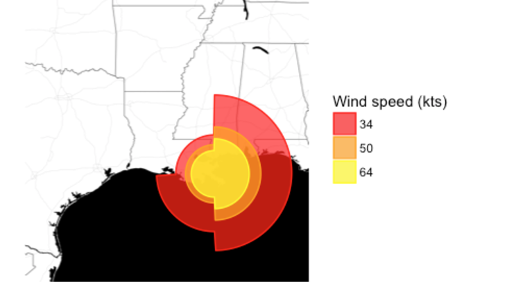

# Assignment
Pier Lorenzo Paracchini, 17.06.2017  

## Purpose

The purpose of this assignment is to use the knowledge acquired in the "Building Data Visualization Tools" course on a real challenge.

## The Problem

_"Hurricanes can have asymmetrical wind fields, with much higher winds on one side of a storm compared to the other. Hurricane wind radii report how far winds of a certain intensity (e.g., 34, 50, or 64 knots) extended from a hurricane’s center, with separate values given for the northeast, northwest, southeast, and southwest quadrants of the storm. The 34 knot radius in the northeast quadrant, for example, reports the furthest distance from the center of the storm of any location that experienced 34-knot winds in that quadrant. This wind radii data provide a clearer picture of the storm structure than the simpler measurements of a storm’s position and maximum winds. For example, if a storm was moving very quickly, the forward motion of the storm might have contributed significantly to wind speeds to the right of the storm’s direction of forward motion, and wind radii might be much larger for the northeast quadrant of the storm than the northwest quadrant."_

An example of the epected result can be found in the following image:

## The Data

The data, these wind radii, are available for Atlantic basin tropical storms since 1988 through the Extended Best Tract dataset, available [here]( http://rammb.cira.colostate.edu/research/tropical_cyclones/tc_extended_best_track_dataset/). The __raw data__, provided for the assignment, can be found in the `ebtrk_atlc_1988_2015.txt` file in the `data` folder of the repository.
