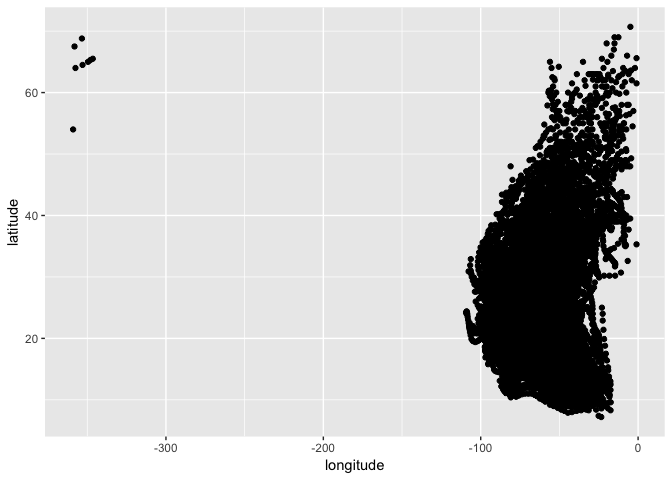

# Cleaning The Data
Pier Lorenzo Paracchini  
6/21/2017  


#### Reading the Data


```r
ext_tracks_widths <- c(7, 10, 2, 2, 3, 5, 5, 6, 4, 5, 4, 4, 5, 3, 4, 3, 3, 3,
                       4, 3, 3, 3, 4, 3, 3, 3, 2, 6, 1)
ext_tracks_colnames <- c("storm_id", "storm_name", "month", "day",
                          "hour", "year", "latitude", "longitude",
                          "max_wind", "min_pressure", "rad_max_wind",
                          "eye_diameter", "pressure_1", "pressure_2",
                          paste("radius_34", c("ne", "se", "sw", "nw"), sep = "_"),
                          paste("radius_50", c("ne", "se", "sw", "nw"), sep = "_"),
                          paste("radius_64", c("ne", "se", "sw", "nw"), sep = "_"),
                          "storm_type", "distance_to_land", "final")

ext_tracks <- read_fwf("./data/ebtrk_atlc_1988_2015.txt", 
                       fwf_widths(ext_tracks_widths, ext_tracks_colnames),
                       na = "-99")
```

#### Cleaning the Data


```r
#Select only the relevant cols
#create a storm_id as the concatenation of the storm name and year
#create a data_time variable describing when the storm was happening
#format the longitute to ensure that has negative values for Western emisphere
#  longitude in raw data is measured in degree West

data_tmp <- ext_tracks %>%
  select(storm_id, storm_name, month, day, hour, year, latitude, longitude, starts_with("radius_")
         ) %>%
  rename(original_id = storm_id) %>%
  mutate(storm_id = paste(storm_name, year, sep = "-"),
         date = make_datetime(year = as.integer(year), 
                              month = as.integer(month), 
                              day = as.integer(day),
                              hour = as.integer(hour),
                              tz = "UTC"),
         longitude = -longitude)

data_p <- data_tmp  %>%
  select(storm_id, date, latitude, longitude, starts_with("radius_"))

ggplot(data = data_p, mapping = aes(y = latitude)) +
  geom_point(aes(x = longitude))
```

<!-- -->

```r

#convert the data to a long format
##       storm_id                date latitude longitude wind_speed  ne  nw  se  sw
## 1 Katrina-2005 2005-08-29 12:00:00     29.5     -89.6         34 200 100 200 150

data_p_34 <- data_p %>%
  select(storm_id, date, latitude, longitude,starts_with("radius_34_")) %>%
  rename(ne = radius_34_ne, se = radius_34_se, nw = radius_34_nw, sw = radius_34_sw) %>%
  mutate(wind_speed = 34)

data_p_50 <- data_p %>%
  select(storm_id, date, latitude, longitude,starts_with("radius_50_")) %>%
  rename(ne = radius_50_ne, se = radius_50_se, nw = radius_50_nw, sw = radius_50_sw) %>%
  mutate(wind_speed = 50)

data_p_64 <- data_p %>%
  select(storm_id, date, latitude, longitude,starts_with("radius_64_")) %>%
  rename(ne = radius_64_ne, se = radius_64_se, nw = radius_64_nw, sw = radius_64_sw) %>%
  mutate(wind_speed = 64)

data_p_long <- rbind(data_p_34, data_p_50, data_p_64) %>%
  arrange(storm_id, date, wind_speed)

print.data.frame(data_p_long[data_p_long$storm_id == "KATRINA-2005" & data_p_long$date == ymd_hms("2005-08-29 12:00:00"),])
##       storm_id                date latitude longitude  ne  se  sw  nw
## 1 KATRINA-2005 2005-08-29 12:00:00     29.5     -89.6 200 200 150 100
## 2 KATRINA-2005 2005-08-29 12:00:00     29.5     -89.6 120 120  75  75
## 3 KATRINA-2005 2005-08-29 12:00:00     29.5     -89.6  90  90  60  60
##   wind_speed
## 1         34
## 2         50
## 3         64
```


```r
write_csv(x = data_p_long, path = "./data/ebtrk_atlc_1988_2015.cleaned.txt")
```

